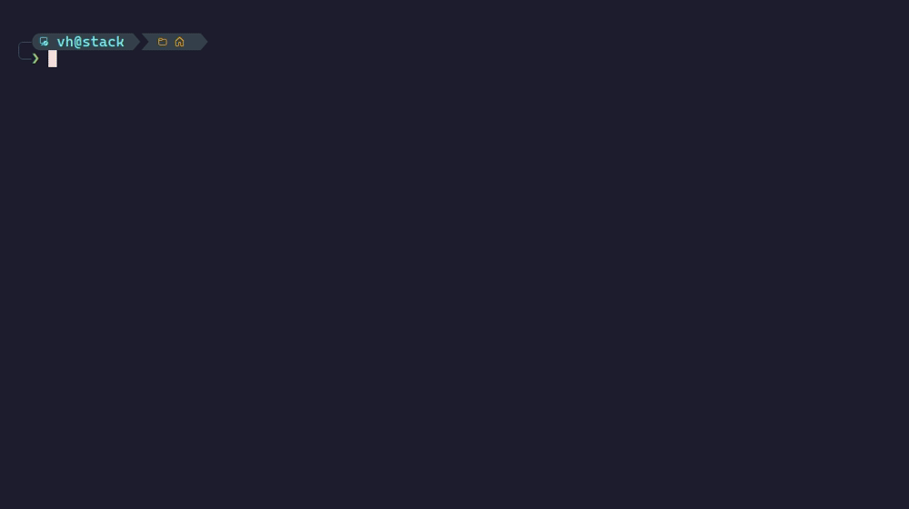
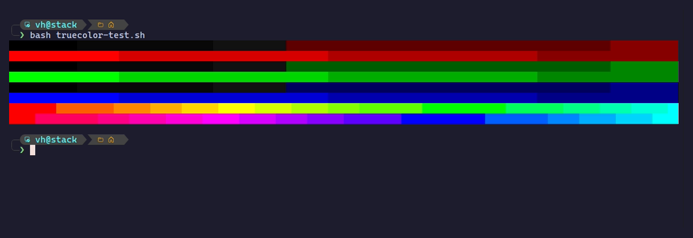
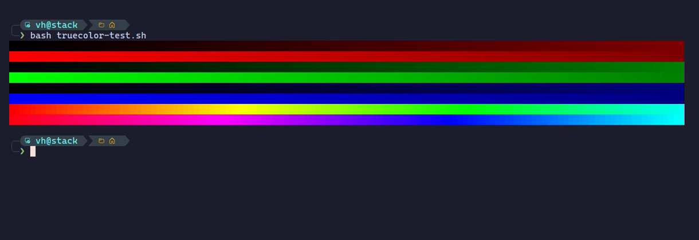

<p align="right">
  <a href="README.md"></a>  
  <a href="README.en.md"></a>  
  <a href="README.ru.md"></a>
</p>

#  termpp – terminal, Nerd Font and prompt

[](https://github.com/vhstack/termpp/tags)

[](https://github.com/vhstack/termpp/actions/workflows/ci.yml)

This guide walks you through setting up a modern, high-performance, and visually appealing terminal environment on Windows.
It includes:

- **Windows Terminal**
- A **Nerd Font** (e.g., Cascadia Code NF)
- A modern **Bash prompt via Oh My Posh**

The guide is split into two parts: **Part 1** sets up the terminal locally 
on Windows, **Part 2** sets up the prompt on the remote server.



termpp is part of [vhstack](https://github.com/vhstack/vhstack). There, a single command sets up prompt, tmux and Neovim together:

```bash
curl -sL https://raw.githubusercontent.com/vhstack/vhstack/main/install.sh | bash
```

## 🪟 Part 1: Windows Terminal (local)

### Terminal Choice

There are many terminal options on Windows. After testing several options, 
I went with [**Windows Terminal**](https://aka.ms/terminal) because it's:

- Fast
- Modern
- Highly configurable
- Lightweight

Windows Terminal is free in the Microsoft Store; the Preview build ships new features earlier:

- [Windows Terminal](https://apps.microsoft.com/detail/9n0dx20hk701)
- [Windows Terminal Preview](https://apps.microsoft.com/detail/9n8g5rfz9xk3)

### Font: Nerd Font with Icon Support

To properly display icons, Git symbols, and stylish prompt elements, you'll need a **Nerd Font**. 
I recommend [**Cascadia Code NF**](https://github.com/microsoft/cascadia-code/releases):

- Clear readability
- Attractive design
- **Ligature** support
- Perfect for developer terminals

> After installing, set the font as default in Windows Terminal (e.g., via `settings.json`).

Ligature examples:

|Input | Display |
|---|--- |
|`->` | → |
|`=>` | ⇒ |
|`!=` | ≠ |
|`==` | ═ |
|`===` | ≡ |
|`<=` | ≤ |

Alternatively, install a Nerd Font that fits your preferences: 
[nerdfonts.com](https://www.nerdfonts.com/)

### Configuring Windows Terminal

Configuration is done via the `settings.json` file:

1. Open the terminal.
2. Press `Ctrl + ,` (or access via the menu).
3. Click on "Settings" (open JSON file).
4. Replace or add your configuration.

A suitable template is included in this repository: [`settings.json`](./settings.json)

Matching wallpaper: [`assets/vhstack_bg.jpg`](./assets/vhstack_bg.jpg) – add it in
`settings.json` via `"backgroundImage"` (start with `"backgroundImageOpacity": 0.95`).

In the `settings.json`, you can define custom SSH profiles under `profiles.list[]` for key-based 
or password-based access to remote servers.

```json
{
    "commandline": "ssh user@server.address",
    "hidden": false,
    "icon": "\ud83d\udda5",
    "name": "My SSH Server"
}
```

To use a specific SSH key, just include it like this:

```json
"commandline": "ssh -i ~/.ssh/id_ed25519 user@server.address"
```

Generate a new SSH key with the following command:

```bash
ssh-keygen -t ed25519 -C "your-comment"
```

**Graphical applications from the remote server (X11 via WSLg):**
WSL2 ships its own X server with WSLg — an additional X server on Windows 
is no longer needed. Build the SSH connection from within WSL; the server's 
X applications appear as regular Windows windows:

```json
"commandline": "wsl.exe -- ssh -X -i ~/.ssh/id_ed25519 user@server.address"
```

Requirements: up-to-date WSL (`wsl --update`); on the server, `xauth` 
installed and `X11Forwarding yes` (the default on Debian/Ubuntu).

**Older X applications** (e.g., legacy Qt/Motif) whose dialogs and popups 
are misplaced under WSLg need a classic X screen with a window manager. 
The [`xssh`](./xssh) script takes care of that (Xephyr + openbox). 
Install once in WSL:

```bash
sudo apt install xserver-xephyr openbox x11-utils
curl -sL https://raw.githubusercontent.com/vhstack/termpp/main/xssh -o ~/.local/bin/xssh && chmod +x ~/.local/bin/xssh
```

When needed, call it from a WSL shell — same parameters as `ssh`. The 
Xephyr window opens on the first call, hosts all X windows of the session, 
and closes automatically when the last session ends:

```bash
xssh user@server.address
```

### Keybindings

| Key Combination | Function |
|---|--- |
|`Shift + ← / →` | Switch between Windows Terminal tabs |
|`Alt + ← / →` | Switch between Tmux windows |
|`Ctrl + ← / →` | Switch between Neovim buffers |
|`Shift + Enter` | Insert newline without submitting |

These settings and the color scheme are aligned with my Neovim and Tmux configurations:

- [`vhstack/tmuxpp`](https://github.com/vhstack/tmuxpp)
- [`vhstack/nvimpp`](https://github.com/vhstack/nvimpp)

---

## 🐧 Part 2: Prompt on the Remote Server

### True Color Support

Ensure `TERM` is set to `xterm-256color`. Add to `.bashrc`, `.zshrc`, or `.profile`:

```bash
export TERM=xterm-256color
```

Use the [`truecolor-test.sh`](./truecolor-test.sh) script to verify true 24-bit color support:

```bash
curl -sL https://raw.githubusercontent.com/vhstack/termpp/main/truecolor-test.sh | bash
```

The script renders a smooth gradient. Visible banding indicates **only 256-color support**; a smooth gradient indicates **true color**.

**256 colors (xterm-256color with 8-bit fallback):**  


**True Color (24-bit):**  


### Shell Prompt with Oh My Posh

A modern, informative Bash prompt can make a big difference. Oh My Posh provides:

- Git branch display
- Exit code indicator
- Visual separation with icons and colors

> Important: Setup is **on the remote server under Bash**, **not locally**.

#### Installation via Script

Install the vhstack prompt theme automatically with the script
[`install.sh`](./install.sh) — run it directly in the terminal
(Bash or Zsh):

```bash
curl -sL https://raw.githubusercontent.com/vhstack/termpp/main/install.sh | bash
```

```zsh
curl -sL https://raw.githubusercontent.com/vhstack/termpp/main/install.sh | zsh
```

The script will:

- Install **Oh My Posh** if needed
- Copy `vhstack.omp.json` to `~/.config/ohmyposh/`
- Append the init line to your `~/.bashrc` or `~/.zshrc`

> **Tip:** After installation, run `source ~/.bashrc` or `source ~/.zshrc` once – or simply restart the terminal.

#### Manual Installation

Instead of the script, you can perform the steps individually:

1. Install Oh My Posh (see the
   [Linux installation guide](https://ohmyposh.dev/docs/installation/linux) for details):

   ```bash
   curl -s https://ohmyposh.dev/install.sh | bash -s
   ```

2. Copy the `vhstack.omp.json` theme — or any other of your choice — to
   `~/.config/ohmyposh/`:

   ```bash
   mkdir -p ~/.config/ohmyposh
   curl -L https://raw.githubusercontent.com/vhstack/termpp/main/vhstack.omp.json -o ~/.config/ohmyposh/vhstack.omp.json
   ```

3. Add the following to `~/.bashrc` or `~/.zshrc`:

   ```bash
   eval "$(~/.local/bin/oh-my-posh init bash --config ~/.config/ohmyposh/vhstack.omp.json)"
   ```

4. Reload the shell configuration:

   ```bash
   . ~/.bashrc
   ```

Your prompt will load automatically on login.

---

## 📎 Useful Links

- [Windows Terminal on GitHub](https://github.com/microsoft/terminal)
- [Microsoft Cascadia Font](https://github.com/microsoft/cascadia-code)
- [Nerd Fonts overview](https://www.nerdfonts.com/)
- [WSLg (GUI apps on WSL)](https://github.com/microsoft/wslg)
- [Oh My Posh documentation](https://ohmyposh.dev/docs)

---

MIT License · part of [vhstack](https://github.com/vhstack/vhstack)
