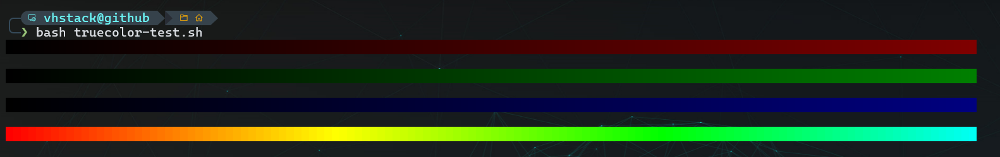

# Modern Terminal Environment on Windows

This guide walks you through setting up a modern, high-performance, and visually appealing terminal environment on Windows.
It includes:

- **Windows Terminal** (Preview version recommended)
- A **Nerd Font** (e.g., Cascadia Code NF)
- A modern **Bash prompt via Oh My Posh**


---

## 📦 Terminal Choice: Windows Terminal

There are many terminal options on Windows. After testing several options, 
I went with [Windows Terminal](https://aka.ms/terminal) because it's:

- Fast
- Modern
- Highly configurable
- Lightweight

I use the **Preview version** to access new features early.

### 🔧 Installation

Windows Terminal is available for free from the Microsoft Store:

- ▶️ [Windows Terminal Preview](https://apps.microsoft.com/store/detail/windows-terminal-preview/9N8GZ8MR0MLW)

---

## 🔤 Font: Nerd Font with Icon Support

To properly display icons, Git symbols, and stylish prompt elements, you'll need a **Nerd Font**. 
I recommend:

### 💎 Cascadia Code NF

➡️ [Download on GitHub](https://github.com/microsoft/cascadia-code/releases)

Advantages:

- Clear readability
- Attractive design
- **Ligature** support
- Perfect for developer terminals

> After installing, set the font as default in Windows Terminal (e.g., via `settings.json`).

#### ✨ Ligature Examples

|Input | Display |
|---|--- |
|`->` | → |
|`=>` | ⇒ |
|`!=` | ≠ |
|`==` | ═ |
|`===` | ≡ |
|`<=` | ≤ |

Alternatively, install a Nerd Font that fits your preferences:

➡️ [Download on nerdfonts.com](https://www.nerdfonts.com/)

---

## ⚙️ Configuring Windows Terminal

Configuration is done via the `settings.json` file.

### 📝 Steps

1. Open the terminal.
2. Press `Ctrl + ,` (or access via the menu).
3. Click on "Settings" (open JSON file).
4. Replace or add your configuration.

In the `settings.json`, you can define custom SSH profiles under `profiles.list[]` for key-based 
or password-based access to remote servers.

```json
{
    "commandline": "ssh user@server.address",
    "hidden": false,
    "icon": "\ud83d\udda5",
    "name": "My SSH Server"
}
```

To use a specific SSH key, just include it like this:

```json
"commandline": "ssh -i ~/.ssh/id_ed25519 user@server.address"
```

👉 Generate SSH keys:

```bash
ssh-keygen -t ed25519 -C "your-comment"
```

### ⌨️ Keybindings

Key Combination | Function |
|---|--- |
|`Shift + ← / →` | Switch between Windows Terminal tabs |
|`Alt + ← / →` | Switch between Tmux windows |
|`Ctrl + ← / →` | Switch between NVim buffers |

These settings and the color scheme are aligned with my Neovim and Tmux configurations:

- [vhstack/tmuxpp](https://github.com/vhstack/tmuxpp)
- [vhstack/nvimpp](https://github.com/vhstack/nvimpp)

---

## 🎨 True Color Support

### ✅ Set the TERM variable

Ensure `TERM` is set to `xterm-256color`. Add to `.bashrc`, `.zshrc`, or `.profile`:

```bash
export TERM=xterm-256color
```

> Note: `tmux-256color` or `screen-256color` also work if your terminal supports true color.

### 🧪 Test Color Rendering

Use the `truecolor-test.sh` script to verify true 24-bit color support:

```bash
curl -sL https://raw.githubusercontent.com/vhstack/termpp/main/truecolor-test.sh | bash
```

The script renders a smooth gradient. Visible banding indicates **only 256-color support**; a smooth gradient indicates **true color**.

### 🖼️ Example Rendering

The 256-color version shows harsh transitions, while True Color provides a smooth gradient.

**256 colors (xterm-256color with 8-bit fallback):**  


**True Color (24-bit):**  


---

## 💠 Shell Prompt with Oh My Posh on a Remote Server

A modern, informative Bash prompt can make a big difference. Oh My Posh provides:

- Git branch display
- Exit code indicator
- Visual separation with icons and colors

> Important: Setup is **on the remote server under Bash**, **not locally**.

### ⚡ Quick Installation

You can automatically install the `vhstack` prompt theme by downloading script:

📥 [Download installation script](https://raw.githubusercontent.com/vhstack/termpp/main/install-termpp.sh)

Or directly running the following script:

```bash
curl -sL https://raw.githubusercontent.com/vhstack/termpp/main/install-termpp.sh | bash
```

Or with Zsh:

```zsh
curl -sL https://raw.githubusercontent.com/vhstack/termpp/main/install-termpp.sh | zsh
```

🔧 The script will:

- 📦 Install Oh My Posh if needed
- 📁 Copy `vhstack.omp.json` to `~/.config/ohmyposh/`
- ✍️ Append the init line to your `~/.bashrc` or `~/.zshrc`

> **Tip:** After installation, run source `~/.bashrc` or source `~/.zshrc` once – or simply restart the terminal.

### 🛠️ Manual Installation Oh My Posh

```bash
curl -s https://ohmyposh.dev/install.sh | bash -s
```

Or see the [Oh My Posh Linux installation guide](https://ohmyposh.dev/docs/linux).

---

## 🎨 Oh My Posh Theme Configuration

Use the `vhstack.omp.json` theme or any other of your choice.

### ✅ Steps

1. Copy `vhstack.omp.json` to `~/.config/ohmyposh/`:

   ```bash
   mkdir -p ~/.config/ohmyposh
   curl -L https://raw.githubusercontent.com/vhstack/termpp/main/vhstack.omp.json -o ~/.config/ohmyposh/vhstack.omp.json
   ```

2. Add the following to `~/.bashrc` or `~/.zshrc`:

   ```bash
   eval "$(~/.local/bin/oh-my-posh init bash --config ~/.config/ohmyposh/vhstack.omp.json)"
   ```

3. Reload shell:

   ```bash
   . ~/.bashrc
   ```

Your prompt will load automatically on login.

---

## 📎 Useful Links

- 💻 [Windows Terminal on GitHub](https://github.com/microsoft/terminal)
- 🔤 [Microsoft Cascadia Font](https://github.com/microsoft/cascadia-code)
- 🔤 [Nerd Fonts overview](https://www.nerdfonts.com/)
- 🖌️ [Oh My Posh documentation](https://ohmyposh.dev/docs)

---

## 🧠 Final Words

This setup gives you a sleek, fast, and visually pleasing environment for daily work.

All components are modular—customize themes, fonts, keybindings, and colors.

Enjoy your new setup and happy hacking! 🚀
