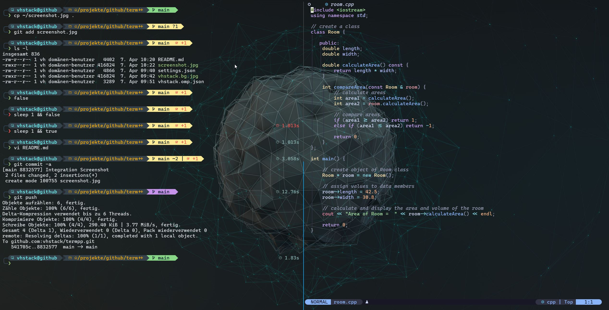

<p align="right">
  <a href="README.md"></a>  
  <a href="README.en.md"></a>  
  <a href="README.ru.md"></a>
</p>

# 🖥️ Moderne Terminal-Arbeitsumgebung unter Windows

Diese Anleitung beschreibt, wie du dir eine moderne, performante und 
optisch ansprechende Terminal-Umgebung unter Windows aufbaust. Sie 
besteht aus:

- **Windows Terminal** (Preview-Version empfohlen)
- einer **Nerd Font** (z. B. Cascadia Code NF)
- einem modernen **Bash Prompt via Oh My Posh**



---

## ⚡ Komplett-Installation: vhstack Full Install

Wer die gesamte vhstack-Arbeitsumgebung — **Oh My Posh Prompt**, **Tmux**
([`vhstack/tmuxpp`](https://github.com/vhstack/tmuxpp)) und **Neovim**
([`vhstack/nvimpp`](https://github.com/vhstack/nvimpp)) — in einem Schritt
auf dem Server einrichten möchte, verwendet das Skript
[`install-vhstack.sh`](./install-vhstack.sh):

```bash
curl -sL https://raw.githubusercontent.com/vhstack/termpp/main/install-vhstack.sh | bash
```

🔧 Das Skript übernimmt automatisch:

- 💾 **Sicherung** vorhandener Konfigurationen nach `~/.vhstack-backup-<Zeitstempel>`
  (`~/.tmux*`, `~/.config/nvim`, Neovim-Plugindaten, Prompt-Theme sowie eine
  Kopie der `~/.bashrc`/`~/.zshrc`)
- 💠 Installation von **Oh My Posh** samt `vhstack.omp.json`-Theme und
  Init-Zeile in `~/.bashrc` bzw. `~/.zshrc`
- 🧩 **Tmux-Konfiguration** inklusive TPM und Plugins
- ✍️ **Neovim-Konfiguration** inklusive Plugin-Synchronisation (headless)

Voraussetzungen: `git` und `curl`; `tmux` und `nvim` sollten installiert sein:

```bash
sudo apt install tmux neovim ripgrep clangd   # Debian/Ubuntu
brew install tmux neovim ripgrep llvm         # macOS
```

> 💡 Danach eine neue Shell starten (oder `source ~/.bashrc`) und `tmux` sowie
> `nvim` einmal öffnen. In Neovim bei Bedarf
> `:MasonInstall clangd cmake-language-server` für den C/C++-LSP ausführen.

---

## 📦 Terminalwahl: Windows Terminal

Es gibt viele Terminal-Optionen unter Windows. Nach zahlreichen Tests 
habe ich mich für [**Windows Terminal**](https://aka.ms/terminal-preview) 
entschieden – es ist:

- schnell
- modern
- flexibel konfigurierbar
- schlank

Ich verwende die **Preview-Version**, um frühzeitig neue Features nutzen 
zu können.

### 🔧 Installation

Windows Terminal ist kostenlos über den Microsoft Store verfügbar:

- ▶️ [Windows Terminal Preview](https://apps.microsoft.com/detail/9n8g5rfz9xk3)

---

## 🔤 Schriftart: Nerd Font mit Symbolunterstützung

Damit Icons, Git-Symbole und hübsche Prompt-Elemente korrekt angezeigt 
werden, brauchst du eine **Nerd Font**. Ich empfehle:

### 💎 Cascadia Code NF

➡️ [Download auf github.com](https://github.com/microsoft/cascadia-code)

Vorteile:

- Klare Lesbarkeit
- Schönes Design
- Unterstützt **Ligaturen**
- Perfekt für Entwicklerterminals

> Nach der Installation kann die Schriftart in Windows Terminal 
(z. B. via `settings.json`) als Standard gesetzt werden. 

#### ✨ Ligaturen-Beispiele

| Eingabe  | Darstellung (Ligatur) |
|----------|------------------------|
| `->`     | →                      |
| `=>`     | ⇒                      |
| `!=`     | ≠                      |
| `==`     | ═                      |
| `===`    | ≡                      |
| `<=`     | ≤                      |


Alternativ kannst du einen Nerd Font installieren, der deinen persönlichen Vorlieben entspricht.

➡️ [Download auf nerdfonts.com](https://www.nerdfonts.com/font-downloads)

---

## ⚙️ Konfiguration von Windows Terminal

Die Anpassung erfolgt über die Datei `settings.json`.

### 📝 Vorgehensweise

1. Öffne den Terminal
2. Drücke `Ctrl + ,` (oder über Menü)
3. Klicke auf „Einstellungen (JSON-Datei öffnen)“
4. Ersetze oder ergänze den Inhalt mit deiner Konfiguration

Du kannst in der `settings.json` Datei von Windows Terminal eigene SSH-Profile unter 
`profiles.list[]` definieren, mit denen du dich entweder per Public-Key oder Passwort 
auf entfernte Server verbinden kannst.

```json
{
    "commandline": "ssh benutzername@serveradresse",
    "hidden": false,
    "icon": "\ud83d\udda5",
    "name": "Mein SSH Server"
}
```

Falls du einen spezifischen SSH-Schlüssel verwenden möchtest, kannst du diesen in der Konfiguration angeben:
```json
"commandline": "ssh -i ~/.ssh/id_ed25519 benutzername@serveradresse"
```

👉 SSH-Schlüssel erzeugen:

Einen neuen Schlüssel erzeugst du mit folgendem Befehl:
```sh
ssh-keygen -t ed25519 -C "dein-kommentar"
```

👉 Nutzung grafischer Programme auf einem entfernten Linux-Server (X11-Forwarding)

Wenn du grafische Programme auf einem entfernten Server nutzen möchtest, empfiehlt sich der Einsatz des XMing Servers.

➡️ [Download auf www.straightrunning.com](http://www.straightrunning.com/XmingNotes)

Nach der Installation wird das Display per X11-Forwarding mit dem Schalter `-X` an das Linux-System weitergeleitet.
```json
"commandline": "cmd.exe /c \"set DISPLAY=127.0.0.1:0.0&& ssh -X -i ~/.ssh/id_ed25519 benutzername@serveradresse\""
```

### ⌨️ Tastenkürzel

| Tastenkombination     | Funktion                               |
|-----------------------|----------------------------------------|
| `Shift + ← / →`       | Wechsel zwischen Windows Terminal Tabs |
| `Alt + ← / →`         | Wechsel zwischen Tmux-Fenstern         |
| `Ctrl + ← / →`        | Wechsel zwischen NVim-Buffern          |

Diese Einstellungen und das Farbschema sind auf meine Konfigurationen 
von Neovim und TMux abgestimmt.

- [`vhstack/tmuxpp`](https://github.com/vhstack/tmuxpp)
- [`vhstack/nvimpp`](https://github.com/vhstack/nvimpp)

---

## 🎨 True Color Unterstützung

### ✅ TERM-Variable setzen

Stelle sicher, dass die Umgebungsvariable `TERM` auf `xterm-256color` gesetzt ist.  
Füge dazu z. B. in `.bashrc`, `.zshrc` oder `.profile` folgende Zeile ein:

```bash
export TERM=xterm-256color
```

### 🧪 Farbdarstellung testen

Mit dem Shellscript [`truecolor-test.sh`](./truecolor-test.sh) kannst du prüfen, ob dein Terminal echte 24-Bit-Farben korrekt darstellt.  
Einfach ausführen:

```bash
curl -sL https://raw.githubusercontent.com/vhstack/termpp/main/truecolor-test.sh | bash
```

Das Skript erzeugt einen weichen Farbverlauf. Falls dein Terminal **nur 256 Farben** unterstützt, erscheinen sichtbare Farbstufen – bei **echtem True Color** ist der Verlauf glatt.

### 🖼️ Beispielhafte Darstellung

Die 256-Farben-Version zeigt harte Übergänge, während True Color einen stufenlosen Verlauf bietet.

**256 Farben (xterm-256color mit 8-bit Fallback):**  


**True Color (24-bit Darstellung):**  


---
## 💠 Shell Prompt mit Oh My Posh auf dem Remote-Server

Ein informatives, modernes Bash Prompt ist Gold wert. 
Mit **Oh My Posh** erhältst du:

- Git-Branch-Anzeige
- Exit-Code-Darstellung
- visuelle Trennung durch Icons und Farben

> Wichtig: Die Einrichtung erfolgt **nur auf dem Remote-Server unter Bash**, **nicht lokal**.

### ⚡ Schnelle Installation

Du kannst das vhstack-Prompt-Theme automatisch installieren, indem du folgendes Skript herunterlädst und startest:

📥 [Installationsskript herunterladen](https://raw.githubusercontent.com/vhstack/termpp/main/install-termpp.sh)

Alternativ direkt im Terminal ausführen (Bash oder Zsh):

```bash
curl -sL https://raw.githubusercontent.com/vhstack/termpp/main/install-termpp.sh | bash
```

```zsh
curl -sL https://raw.githubusercontent.com/vhstack/termpp/main/install-termpp.sh | zsh
```

🔧 Das Skript übernimmt automatisch:

- 📦 Installation von **Oh My Posh** (falls noch nicht vorhanden)
- 📁 Kopieren des Themes `vhstack.omp.json` nach `~/.config/ohmyposh/`
- ✍️ Ergänzen deiner `~/.bashrc` oder `~/.zshrc` mit der passenden Init-Zeile

> 💡 **Tipp:** Nach der Installation einmal `source ~/.bashrc` oder `source ~/.zshrc` ausführen – oder das Terminal neu starten.

### 🛠️ Manuelle Installation

```bash
curl -s https://ohmyposh.dev/install.sh | bash -s
```

Oder nachlesen:  
👉 [Oh My Posh – Linux Installationsanleitung](https://ohmyposh.dev/docs/installation/linux)

---

## 🎨 Theme-Konfiguration für Oh My Posh

Verwende das Theme `vhstack.omp.json` oder ein beliebiges anderes 
nach deinem Geschmack.

### ✅ Schritte:

1. Kopiere `vhstack.omp.json` auf dem Server in das Verzeichnis `~/.config/ohmyposh`:

```bash
mkdir -p ~/.config/ohmyposh
curl -L https://raw.githubusercontent.com/vhstack/termpp/main/vhstack.omp.json -o .config/ohmyposh/vhstack.omp.json
```

2. Ergänze in `~/.bashrc` oder `~/.zshrc`:

```bash
eval "$(~/.local/bin/oh-my-posh init bash --config ~/.config/ohmyposh/vhstack.omp.json)"
```

3. Lade die Shell-Konfiguration neu:

```bash
. ~/.bashrc
```

Dein Shell-Prompt wird nun automatisch bei jeder Anmeldung (login) geladen.

---

## 📎 Nützliche Links

- 💻 [Windows Terminal GitHub](https://github.com/microsoft/terminal)
- 🔤 [Microsoft Cascadia Font](https://github.com/microsoft/cascadia-code)
- 🔤 [Nerd Fonts Übersicht](https://www.nerdfonts.com/font-downloads)
- 💻 [XMing Server](http://www.straightrunning.com/XmingNotes)
- 🖌️ [Oh My Posh Dokumentation](https://ohmyposh.dev/)

---

## 🎯 Schlusswort

Mit dieser Umgebung hast du ein schlankes, schnelles und optisch 
ansprechendes Setup für deine tägliche Arbeit.

Alle Teile sind modular anpassbar – Themes, Schriftarten, Tastenkürzel, Farben.  

Viel Spaß beim Einrichten – und happy hacking! 🚀
