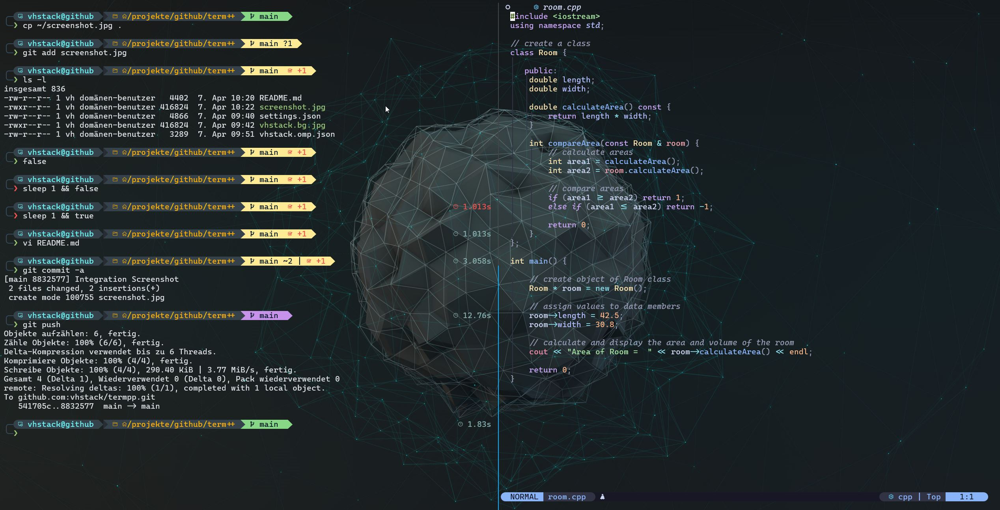

# 🖥️ Moderne Terminal-Arbeitsumgebung unter Windows

Diese Anleitung beschreibt, wie du dir eine moderne, performante und 
optisch ansprechende Terminal-Umgebung unter Windows aufbaust. Sie 
besteht aus:

- **Windows Terminal** (Preview-Version empfohlen)
- einer **Nerd Font** (z. B. Cascadia Code NF)
- einem modernen **Bash Prompt via Oh My Posh**



---

## 📦 Terminalwahl: Windows Terminal

Es gibt viele Terminal-Optionen unter Windows. Nach zahlreichen Tests 
habe ich mich für [**Windows Terminal**](https://aka.ms/terminal-preview) 
entschieden – es ist:

- schnell
- modern
- flexibel konfigurierbar
- schlank

Ich verwende die **Preview-Version**, um frühzeitig neue Features nutzen 
zu können.

### 🔧 Installation

Windows Terminal ist kostenlos über den Microsoft Store verfügbar:

- ▶️ [Windows Terminal Preview](https://apps.microsoft.com/detail/9n8g5rfz9xk3)

---

## 🔤 Schriftart: Nerd Font mit Symbolunterstützung

Damit Icons, Git-Symbole und hübsche Prompt-Elemente korrekt angezeigt 
werden, brauchst du eine **Nerd Font**. Ich empfehle:

### 💎 Cascadia Code NF

➡️ [Download auf github.com](https://github.com/microsoft/cascadia-code)

Vorteile:

- Klare Lesbarkeit
- Schönes Design
- Unterstützt **Ligaturen**
- Perfekt für Entwicklerterminals

> Nach der Installation kann die Schriftart in Windows Terminal 
(z. B. via `settings.json`) als Standard gesetzt werden. 

#### ✨ Ligaturen-Beispiele

| Eingabe  | Darstellung (Ligatur) |
|----------|------------------------|
| `->`     | →                      |
| `=>`     | ⇒                      |
| `!=`     | ≠                      |
| `==`     | ═                      |
| `===`    | ≡                      |
| `<=`     | ≤                      |


Alternativ kannst du einen Nerd Font installieren, der deinen persönlichen Vorlieben entspricht.

➡️ [Download auf nerdfonts.com](https://www.nerdfonts.com/font-downloads)

---

## ⚙️ Konfiguration von Windows Terminal

Die Anpassung erfolgt über die Datei `settings.json`.

### 📝 Vorgehensweise

1. Öffne den Terminal
2. Drücke `Ctrl + ,` (oder über Menü)
3. Klicke auf „Einstellungen (JSON-Datei öffnen)“
4. Ersetze oder ergänze den Inhalt mit deiner Konfiguration

### ⌨️ Tastenkürzel

| Tastenkombination     | Funktion                               |
|-----------------------|----------------------------------------|
| `Shift + ← / →`       | Wechsel zwischen Windows Terminal Tabs |
| `Alt + ← / →`         | Wechsel zwischen Tmux-Fenstern         |
| `Ctrl + ← / →`        | Wechsel zwischen NVim-Buffern          |

Diese Einstellungen und das Farbschema sind auf meine Konfigurationen 
von Neovim und TMux abgestimmt.

- [`vhstack/tmuxpp`](https://github.com/vhstack/tmuxpp)
- [`vhstack/nvimpp`](https://github.com/vhstack/nvimpp)

---

## 🎨 True Color Unterstützung

### ✅ TERM-Variable setzen

Stelle sicher, dass die Umgebungsvariable `TERM` auf `xterm-256color` gesetzt ist.  
Füge dazu z. B. in `.bashrc`, `.zshrc` oder `.profile` folgende Zeile ein:

```bash
export TERM=xterm-256color
```

> Hinweis: Auch `tmux-256color` oder `screen-256color` funktionieren, wenn dein Terminal True Color unterstützt.

### 🧪 Farbdarstellung testen

Mit dem Shellscript [`truecolor-test.sh`](./truecolor-test.sh) kannst du prüfen, ob dein Terminal echte 24-Bit-Farben korrekt darstellt.  
Einfach ausführen:

```bash
curl -sL https://raw.githubusercontent.com/vhstack/termpp/main/truecolor-test.sh | bash
```

Das Skript erzeugt einen weichen Farbverlauf. Falls dein Terminal **nur 256 Farben** unterstützt, erscheinen sichtbare Farbstufen – bei **echtem True Color** ist der Verlauf glatt.

### 🖼️ Beispielhafte Darstellung

Die 256-Farben-Version zeigt harte Übergänge, während True Color einen stufenlosen Verlauf bietet.

**256 Farben (xterm-256color mit 8-bit Fallback):**  


**True Color (24-bit Darstellung):**  


---
## 💠 Shell Prompt mit Oh My Posh auf dem Remote-Server

Ein informatives, modernes Bash Prompt ist Gold wert. 
Mit **Oh My Posh** erhältst du:

- Git-Branch-Anzeige
- Exit-Code-Darstellung
- visuelle Trennung durch Icons und Farben

> Wichtig: Die Einrichtung erfolgt **nur auf dem Remote-Server unter Bash**, **nicht lokal**.

### ⚡ Schnelle Installation

Du kannst das vhstack-Prompt-Theme automatisch installieren, indem du folgendes Skript herunterlädst oder direkt ausführst:

📥 [Installationsskript herunterladen](https://raw.githubusercontent.com/vhstack/termpp/main/install-termpp.sh)

Alternativ direkt im Terminal ausführen (Bash oder Zsh):

```bash
curl -sL https://raw.githubusercontent.com/vhstack/termpp/main/install-termpp.sh | bash
```

```zsh
curl -sL https://raw.githubusercontent.com/vhstack/termpp/main/install-termpp.sh | zsh
```

🔧 Das Skript übernimmt automatisch:

- 📦 Installation von **Oh My Posh** (falls noch nicht vorhanden)
- 📁 Kopieren des Themes `vhstack.omp.json` nach `~/.config/ohmyposh/`
- ✍️ Ergänzen deiner `~/.bashrc` oder `~/.zshrc` mit der passenden Init-Zeile

> 💡 **Tipp:** Nach der Installation einmal `source ~/.bashrc` oder `source ~/.zshrc` ausführen – oder das Terminal neu starten.

### 🛠️ Manuelle Installation

```bash
curl -s https://ohmyposh.dev/install.sh | bash -s
```

Oder nachlesen:  
👉 [Oh My Posh – Linux Installationsanleitung](https://ohmyposh.dev/docs/installation/linux)

---

## 🎨 Theme-Konfiguration für Oh My Posh

Verwende das Theme `vhstack.omp.json` oder ein beliebiges anderes 
nach deinem Geschmack.

### ✅ Schritte:

1. Kopiere `vhstack.omp.json` auf dem Server in das Verzeichnis `~/.config/ohmyposh`:

```bash
mkdir -p ~/.config/ohmyposh
curl -L https://raw.githubusercontent.com/vhstack/termpp/main/vhstack.omp.json -o .config/ohmyposh/vhstack.omp.json
```

2. Ergänze in `~/.bashrc` oder `~/.zshrc`:

```bash
eval "$(~/.local/bin/oh-my-posh init bash --config ~/.config/ohmyposh/vhstack.omp.json)"
```

3. Lade die Bash neu:

```bash
. ~/.bashrc
```

Dein Shell-Prompt wird nun automatisch bei jeder Anmeldung (login) geladen.

---

## 📎 Nützliche Links

- 💻 [Windows Terminal GitHub](https://github.com/microsoft/terminal)
- 🔤 [Microsoft Cascadia Font](https://github.com/microsoft/cascadia-code)
- 🔤 [Nerd Fonts Übersicht](https://www.nerdfonts.com/font-downloads)
- 🖌️ [Oh My Posh Dokumentation](https://ohmyposh.dev/)

---

## 🧠 Schlusswort

Mit dieser Umgebung hast du ein schlankes, schnelles und optisch 
ansprechendes Setup für deine tägliche Arbeit.

Alle Teile sind modular anpassbar – Themes, Schriftarten, Tastenkürzel, Farben.  

👉 **Dein Terminal. Dein Workflow. Dein Stil.**

Viel Spaß beim Einrichten – und happy hacking! 🚀
