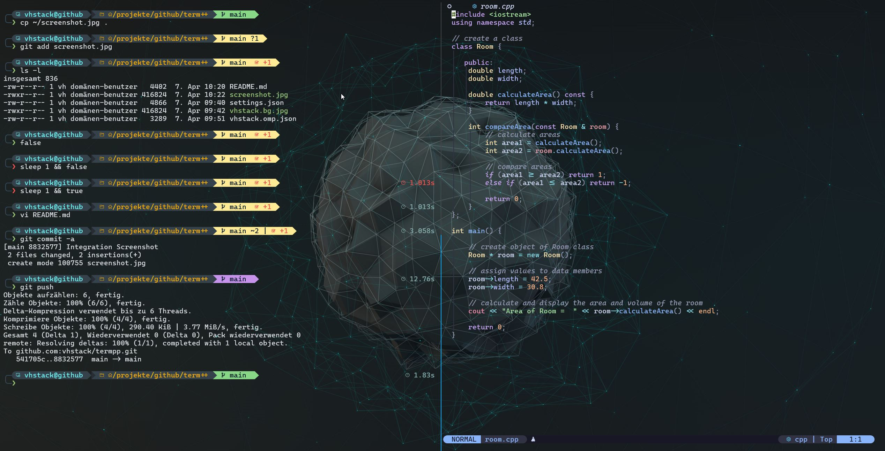
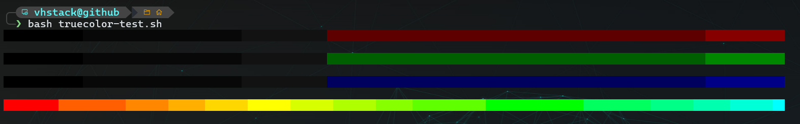
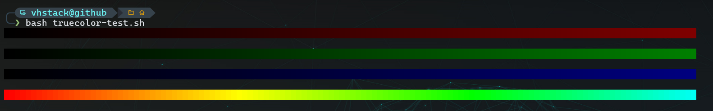

<p align="right">
  <a href="README.md"></a>  
  <a href="README.en.md"></a>  
  <a href="README.ru.md"></a>
</p>

# 🖥️ Современная терминальная среда в Windows

В этом руководстве описывается, как создать современную, производительную и эстетически привлекательную терминальную среду в Windows. Она включает в себя:

- **Windows Terminal** (рекомендуется Preview-версия)
- **Nerd Font** (например, Cascadia Code NF)
- современный **Bash Prompt с Oh My Posh**



---

## 📦 Выбор терминала: Windows Terminal

Существует множество вариантов терминалов для Windows. После многочисленных тестов я выбрал [**Windows Terminal**](https://aka.ms/terminal-preview) – он:

- быстрый  
- современный  
- гибко настраиваемый  
- легковесный  

Я использую **Preview-версию**, чтобы опробовать новые функции раньше всех.

### 🔧 Установка

Windows Terminal доступен бесплатно в Microsoft Store:

- ▶️ [Windows Terminal Preview](https://apps.microsoft.com/detail/9n8g5rfz9xk3)

---

## 🔤 Шрифт: Nerd Font с поддержкой иконок

Для корректного отображения иконок, символов Git и элементов prompt необходима **Nerd Font**. Рекомендую:

### 💎 Cascadia Code NF

➡️ [Загрузить с GitHub](https://github.com/microsoft/cascadia-code)

Преимущества:

- Чёткая читаемость  
- Элегантный дизайн  
- Поддержка **лигатур**  
- Идеально подходит для терминалов разработчика

> После установки шрифт можно выбрать в Windows Terminal через `settings.json` как основной.

#### ✨ Примеры лигатур

| Ввод    | Отображение (лигатура) |
|---------|------------------------|
| `->`    | →                      |
| `=>`    | ⇒                      |
| `!=`    | ≠                      |
| `==`    | ═                      |
| `===`   | ≡                      |
| `<=`    | ≤                      |

Альтернативно можно установить любой другой Nerd Font по вкусу:

➡️ [Загрузить на nerdfonts.com](https://www.nerdfonts.com/font-downloads)

---

## ⚙️ Настройка Windows Terminal

Конфигурация выполняется в файле `settings.json`.

### 📝 Алгоритм действий

1. Откройте Windows Terminal  
2. Нажмите `Ctrl + ,` (или выберите «Настройки» в меню)  
3. Откройте `settings.json`  
4. Добавьте или измените нужные параметры

В `profiles.list[]` можно создавать профили SSH для подключения к удалённым серверам:

```json
{
    "commandline": "ssh username@server.address",
    "hidden": false,
    "name": "Мой SSH-сервер"
}
```

Для использования специфического SSH-ключа:

```json
"commandline": "ssh -i ~/.ssh/id_ed25519 username@server.address"
```

👉 Создание SSH-ключа:

```sh
ssh-keygen -t ed25519 -C "ваш комментарий"
```

👉 Использование графических приложений на удалённом Linux-сервере (X11-переадресация)

Если вы хотите использовать графические приложения на удалённом сервере, рекомендуется использовать XMing Server.

➡️ [Загрузка на www.straightrunning.com](http://www.straightrunning.com/XmingNotes)

После установки дисплей перенаправляется в систему Linux с помощью X11-переадресации с использованием ключа `-X`.
```json
"commandline": "cmd.exe /c \"set DISPLAY=127.0.0.1:0.0&& ssh -X -i ~/.ssh/id_ed25519 user@server.adress\""
```

### ⌨️ Горячие клавиши

| Сочетание            | Действие                                  |
|----------------------|-------------------------------------------|
| `Shift + ← / →`      | Переключение вкладок в Windows Terminal   |
| `Alt + ← / →`        | Переключение окон Tmux                   |
| `Ctrl + ← / →`       | Переключение буферов NVim                |

Эти настройки и цветовая схема согласованы с моими конфигурациями Neovim и Tmux:

- [`vhstack/tmuxpp`](https://github.com/vhstack/tmuxpp)
- [`vhstack/nvimpp`](https://github.com/vhstack/nvimpp)

---

## 🎨 Поддержка True Color

### ✅ Установка переменной TERM

Убедитесь, что переменная `TERM` установлена в `xterm-256color`.  
Добавьте в `.bashrc`, `.zshrc` или `.profile`:

```bash
export TERM=xterm-256color
```

### 🧪 Проверка отображения цветов

Скрипт [`truecolor-test.sh`](./truecolor-test.sh) поможет проверить поддержку 24-битного цвета. Запустите:

```bash
curl -sL https://raw.githubusercontent.com/vhstack/termpp/main/truecolor-test.sh | bash
```

Если терминал поддерживает только 256 цветов, градиент будет ступенчатым; при True Color — плавным.

### 🖼️ Примеры

**256 цветов (xterm-256color с fallback 8-bit):**  


**True Color (24-bit):**  


---

## 💠 Bash Prompt с Oh My Posh на удалённом сервере

Информативный и современный Bash Prompt — бесценен. С **Oh My Posh** вы получаете:

- Отображение ветки Git  
- Код завершения последней команды  
- Визуальное разделение через иконки и цвета

> Важно: настройка производится **только** на удалённом сервере в Bash, **не локально**.

### ⚡ Быстрая установка

Автоматический скрипт установки vhstack-Prompt:

📥 [Скачать скрипт установки](https://raw.githubusercontent.com/vhstack/termpp/main/install-termpp.sh)

Или выполнить напрямую:

```bash
curl -sL https://raw.githubusercontent.com/vhstack/termpp/main/install-termpp.sh | bash
```

```zsh
curl -sL https://raw.githubusercontent.com/vhstack/termpp/main/install-termpp.sh | zsh
```

Скрипт автоматически:

- 📦 Устанавливает **Oh My Posh**  
- 📁 Копирует тему `vhstack.omp.json` в `~/.config/ohmyposh/`  
- ✍️ Добавляет в `~/.bashrc` или `~/.zshrc` строку инициализации

> 💡 После установки выполните `source ~/.bashrc` или перезапустите терминал.

### 🛠️ Ручная установка

```bash
curl -s https://ohmyposh.dev/install.sh | bash -s
```

Подробности:  
👉 [Oh My Posh – Linux Installation](https://ohmyposh.dev/docs/installation/linux)

---

## 🎨 Конфигурация темы Oh My Posh

Используйте тему `vhstack.omp.json` или любую другую на ваш вкус.

### ✅ Шаги:

1. Создайте директорию и загрузите тему:
```bash
mkdir -p ~/.config/ohmyposh
curl -L https://raw.githubusercontent.com/vhstack/termpp/main/vhstack.omp.json -o ~/.config/ohmyposh/vhstack.omp.json
```
2. Добавьте в `~/.bashrc` или `~/.zshrc`:
```bash
eval "$(~/.local/bin/oh-my-posh init bash --config ~/.config/ohmyposh/vhstack.omp.json)"
```
3. Загрузите обновления:
```bash
. ~/.bashrc
```

Теперь ваш prompt будет автоматически загружаться при входе в систему.

---

## 📎 Полезные ссылки

- 💻 [Windows Terminal GitHub](https://github.com/microsoft/terminal)
- 🔤 [Microsoft Cascadia Font](https://github.com/microsoft/cascadia-code)
- 🔤 [Nerd Fonts Overview](https://www.nerdfonts.com/font-downloads)
- 💻 [XMing Server](http://www.straightrunning.com/XmingNotes)
- 🖌️ [Oh My Posh Documentation](https://ohmyposh.dev/)

---

## 🎯 Заключение

С этой средой вы получите лёгкую, быструю и эстетичную конфигурацию для ежедневной работы. Все компоненты модульны — темы, шрифты, горячие клавиши и цвета легко настраиваются под вас.  

Приятной настройки и happy hacking! 🚀
